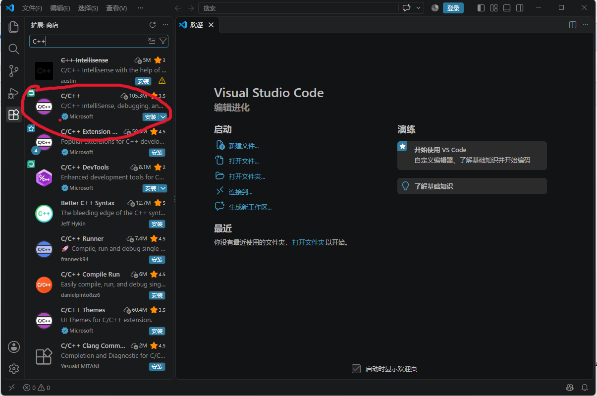
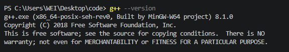
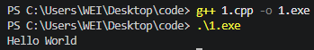

# cpp-configuration
Configure the C++ development environment in VScode via the integrated PowerShell command line

1.从Visual Studio code[官网](https://code.visualstudio.com) 下载VScode并安装，安装程序全部选择“next”即可。

2.点击"View"，选择"Extensions",搜索“Chinese”，安装简体中文插件。

3.在VScode界面按`Ctrl+Shift+P`组合键，搜索display，点击`Configure Display Language`，选择“简体中文”，点击“restart”

4.Visual Studio code作用如其名，“可视化的代码工作站”，是一个代码编辑器，并不包含具有编译功能的插件。MinGW-w64 是 Windows 下的 GCC 编译器，负责把 `.cpp` 源码翻译成电脑能执行的 exe 文件。

mingw-w64的编译器套件如下：

（1）. `g++.exe`：C++ 编译器，读取 `.cpp` 源码 → 编译链接 → 生成 `.exe` 可执行程序

（2）. `gcc.exe`：C 语言编译器

（3）. `gdb.exe`：调试器，用来断点调试 C++ 程序

（4）. 配套头文件、标准库（`iostream`、`vector` 这些 C++ 标准库实现）

在`Windows PowerShell`中输入如下命令
```bash
git clone https://git.code.sf.net/p/mingw-w64/mingw-w64 mingw-w64
```
或在[网页](https://sourceforge.net/projects/mingw-w64/files/Toolchains%20targetting%20Win64/Personal%20Builds/mingw-builds/8.1.0/threads-posix/seh/x86_64-8.1.0-release-posix-seh-rt_v6-rev0.7z/download)下载即可

5.配置环境变量

右击此电脑->点击“属性”->点击“高级系统设置”->点击用户变量中的Path->点击`新建`->复制Mingw-w64/bin的文件夹路径并粘贴，点击`确定`


6.配置C++插件

在VScode中插件搜索“C++” 安装第一个即可

如截图images/pic1.png



7.配置编译环境

新建文件夹code,用VScode打开这个文件夹，新建1.cpp（如仓库所示），按`Ctrl+Shift+P`组合键，搜索C++，点击“编辑配置(UI)”，编译器路径输入环境变量的路径再加"/g++.exe"，IntelliSense 模式选择“Windows-gcc-x64”

8.测试是否成功

VScode中新建Powershell终端，

输入
```bash
g++ version
```
输出
```text
g++.exe (x86_64-posix-seh-rev0, Built by MinGW-W64 project) 8.1.0
Copyright (C) 2018 Free Software Foundation, Inc.
This is free software; see the source for copying conditions.  There is NO
warranty; not even for MERCHANTABILITY or FITNESS FOR A PARTICULAR PURPOSE.
```



输入

编译指令
```text
g++ 1.cpp -o 1.exe
```
运行指令
```text
.\1.exe
```
输出
```text
Hello World
```



证明配置成功
